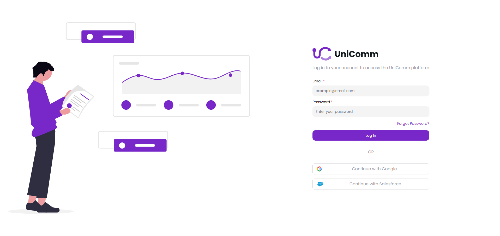
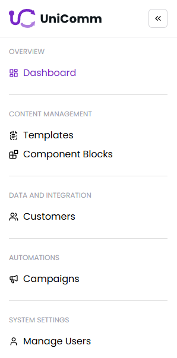
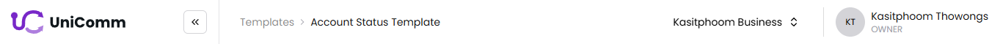
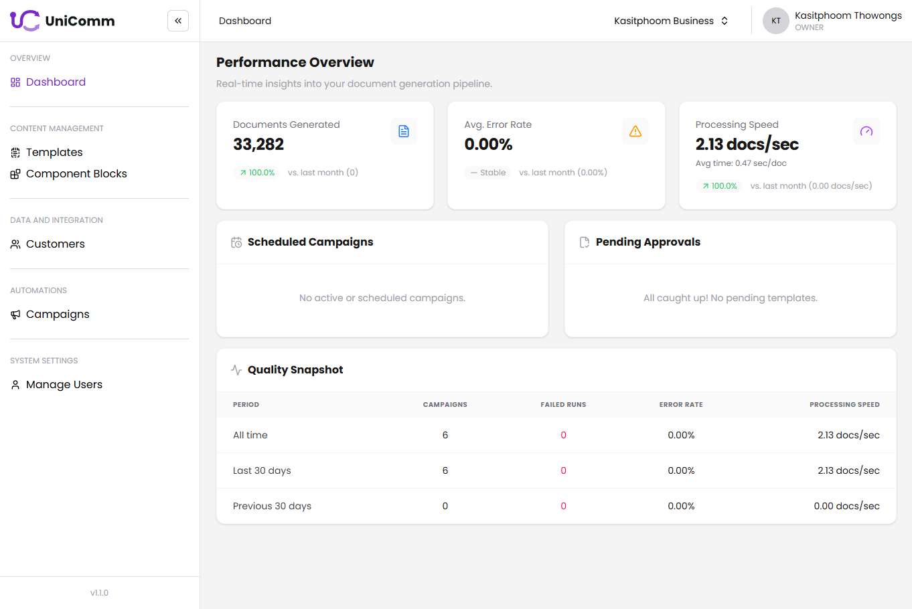
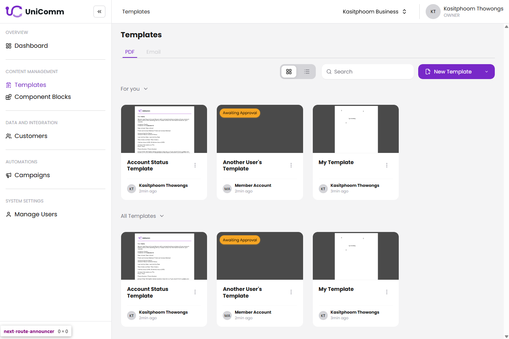
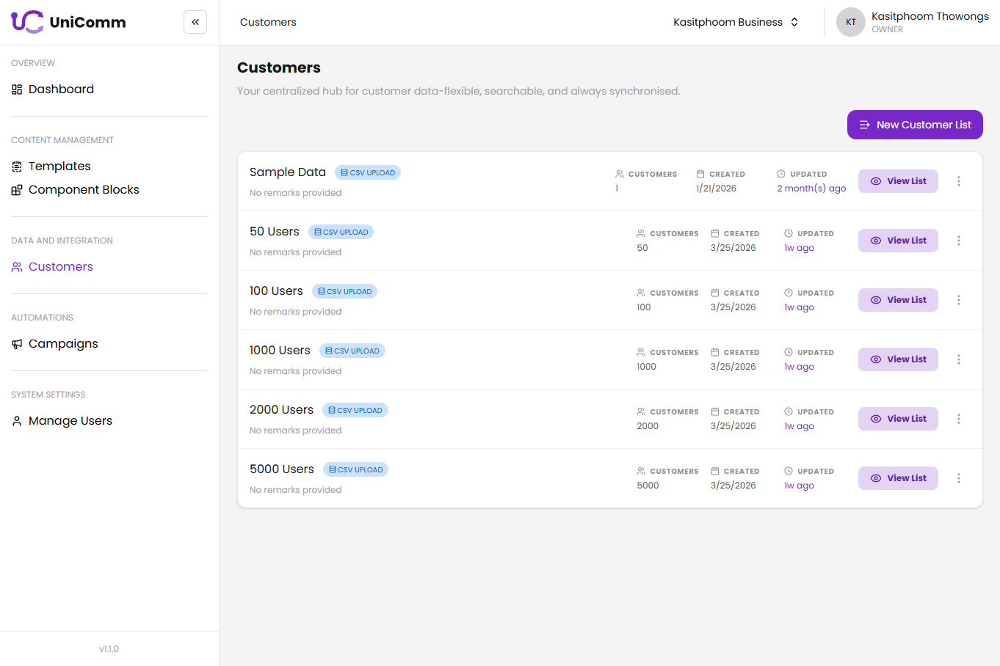
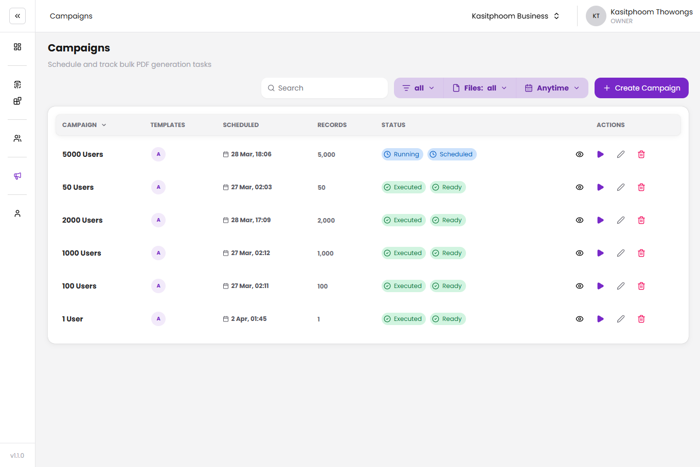
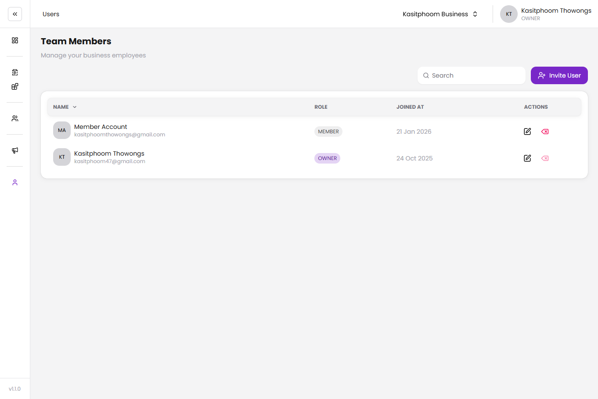

# UniComm User Manual

**Version 1.1** | Document Generation & Campaign Management Platform

---

## Table of Contents

1. [Getting Access](#1-getting-access)
2. [Account Setup & Login](#2-account-setup--login)
   - [Logging In](#21-logging-in)
   - [Forgot Password](#22-forgot-password)
   - [Accepting a Business Invitation](#23-accepting-a-business-invitation)
3. [Platform Overview](#3-platform-overview)
   - [Navigation Sidebar](#31-navigation-sidebar)
   - [Header Bar](#32-header-bar)
   - [Business Selector](#33-business-selector)
   - [User Menu](#34-user-menu)
4. [Dashboard](#4-dashboard)
5. [Templates](#5-templates)
   - [Template List](#51-template-list)
   - [Creating a Template](#52-creating-a-template)
   - [Template Editor](#53-template-editor)
   - [Template Settings](#54-template-settings)
   - [Preview & Export](#55-preview--export)
   - [Template Approval Workflow](#56-template-approval-workflow)
6. [Component Blocks](#6-component-blocks)
   - [Component Block List](#61-component-block-list)
   - [Creating a Component Block](#62-creating-a-component-block)
   - [Component Block Editor](#63-component-block-editor)
7. [Customers](#7-customers)
   - [Customer Lists](#71-customer-lists)
   - [Creating a Customer List](#72-creating-a-customer-list)
   - [Managing Customers in a List](#73-managing-customers-in-a-list)
8. [Campaigns](#8-campaigns)
   - [Campaign List](#81-campaign-list)
   - [Creating a Campaign](#82-creating-a-campaign)
   - [Campaign Detail & Monitoring](#83-campaign-detail--monitoring)
   - [Editing a Campaign](#84-editing-a-campaign)
9. [Manage Users](#9-manage-users)
   - [User List](#91-user-list)
   - [Inviting a User](#92-inviting-a-user)
   - [Editing a User](#93-editing-a-user)
   - [Removing a User](#94-removing-a-user)
10. [Roles & Permissions](#10-roles--permissions)
11. [API Documentation](#11-api-documentation)
12. [Troubleshooting & Error Reference](#12-troubleshooting--error-reference)

---

## 1. Getting Access

UniComm is a closed-platform business tool. **There is no self-service sign-up.** To gain access, you must be onboarded through one of two paths:

### For New Businesses

If your organisation does not yet have a UniComm workspace, contact the development team to request a new business account:

- **Email:** [contact the UniComm development team]
- **Subject line:** `New Business Request – [Your Company Name]`
- Include your company name, number of expected users, and a brief description of your use case.

The team will provision a workspace and create an Owner account for your organisation. You will be granted access to your business by using your request email to reset your password - see [Forgot Password](#22-forgot-password) to get started.

> **Note:** Onboarding for new businesses is handled directly by the UniComm team. There is no self-serve registration portal.

### For New Users in an Existing Business

If your organisation already has a UniComm workspace, ask your workspace **Owner** or **Admin** to invite you. See [Inviting a User](#92-inviting-a-user) for the steps they must follow.

You will receive an invitation email with a unique link. See [Accepting a Business Invitation](#23-accepting-a-business-invitation) for how to proceed.

---

## 2. Account Setup & Login

### 2.1 Logging In

  

Navigate to the UniComm application URL provided by your administrator.

**Steps:**

1. Enter your **Email address** in the email field.
2. Enter your **Password** in the password field.
3. Click **Sign In**.

**Alternative sign-in methods:**

- **Sign in with Google** - Click the Google button to authenticate using your Google account. You will be redirected to Google for authentication and returned to UniComm on success.
- **Sign in with Salesforce** - Click the Salesforce button to authenticate using your Salesforce credentials.

After a successful login, you will be directed to the **Dashboard**. If your account is associated with multiple workspaces, you may be prompted to select which business to enter first (see [Business Selector](#33-business-selector)).

**Common login errors:**

| Error | Meaning |
|-------|---------|
| Invalid email or password | Credentials do not match any account |
| Access denied or not registered | Your account exists but you have not been added to any workspace, or access has been revoked |

---

### 2.2 Forgot Password

  

If you cannot remember your password:

1. On the login page, click **Forgot Password?**.
2. Enter the **email address** associated with your account.
3. Click **Send Reset Link**.
4. Check your inbox for a password reset email.
5. Click the link in the email. It will open a password reset form.
6. Enter your **new password** and confirm it.
7. Click **Reset Password**.
8. You will be redirected to the login page to sign in with your new credentials.

  

> **Note:** Reset links expire after a limited time. If your link has expired, repeat the process from step 1.

---

### 2.3 Accepting a Business Invitation

When an Owner or Admin invites you to a workspace, you will receive an email containing a unique invitation link (`/business/invite?ref=...`).

  

**Steps:**

1. Click the invitation link in your email.
2. If you are not logged in, you will be prompted to log in first. Use the same email address the invitation was sent to.
3. Once logged in, the invitation page will display the workspace you are being invited to join.
4. You will be **automatically accept** the invitation.
5. You will be redirected to the Dashboard within the new workspace.

**If you see an error:**

| Error | Cause | Resolution |
|-------|-------|------------|
| Wrong Account | You are logged in with a different email than the invited address | Click **Sign Out & Switch Account**, then log in with the correct email |
| Invitation Expired | The invitation link has passed its expiry time | Ask the Owner/Admin to send a new invitation |

---

## 3. Platform Overview

### 3.1 Navigation Sidebar

  

The sidebar is located on the left side of the screen. It organises all main sections of the platform into groups.

| Group | Item | Path |
|-------|------|-------|
| **Overview** | Dashboard | `/dashboard` |
| **Content Management** | Templates | `/templates` |
| | Component Blocks | `/components` |
| **Data and Integration** | Customers | `/customers` |
| **Automations** | Campaigns | `/campaigns` |
| **System Settings** | Manage Users | `/users` |

**Collapsing the sidebar:**
Click the toggle icon at the top of the sidebar to collapse it to icon-only mode, giving more space for the main content area.

  

**On mobile:** The sidebar is hidden. Tap the hamburger menu icon in the top-left of the header to open a mobile navigation drawer.

  

---

### 3.2 Header Bar

  

The header bar runs across the top of every page and contains:

- **Breadcrumbs** - shows your current location within the platform (e.g., `Template > My Template`). Breadcrumb segments are clickable and navigate back to parent pages.
- **Business Selector** - switch between multiple workspaces (see [3.3](#33-business-selector)).
- **User Menu** - access account options (see [3.4](#34-user-menu)).

---

### 3.3 Business Selector

  

If your user account belongs to multiple workspaces, you can switch between them using the Business Selector in the header.

**Steps:**

1. Click the **Business Selector** button in the header (shows your current workspace name).
2. A modal showing all workspaces you belong to, along with your role in each.
3. Click the workspace you want to switch to.
4. The page will refresh and you will be inside the selected workspace.

> **Note:** All data (templates, campaigns, customers, users) is scoped to the active workspace. Switching workspaces changes the entire context of the application.

---

### 3.4 User Menu

  

Click your **avatar or name** in the top-right corner of the header to open the user menu.

**Available actions:**

- **Logout** - Signs you out and redirects to the login page.

---

## 4. Dashboard

  

The Dashboard provides a real-time overview of your document generation pipeline.

**Navigate to:** Sidebar → **Dashboard**

### Performance Metrics

Three summary cards appear at the top:

| Card | What it shows |
|------|---------------|
| **Documents Generated** | Total documents generated all-time and in the last 30 days, with a delta vs. the previous period |
| **Average Error Rate** | Percentage of failed documents with a trend indicator (up/down arrow) |
| **Processing Speed** | Documents per second and average time per document |

  

### Scheduled Campaigns Widget

Lists upcoming campaigns with status indicators:

- **Red pulsing dot** - Campaign has errors and requires attention.
- **Blue/orange dot** - Campaign is scheduled or overdue.

Click any campaign name to navigate to its [Campaign Detail](#83-campaign-detail--monitoring) page.

  

### Pending Approvals Widget

Lists templates that are waiting for your approval.

- Each row shows the template name with a warning indicator.
- Click a template name to navigate to its [Template Editor](#53-template-editor) where you can review and approve/reject it.
- When there are no pending approvals, the widget shows **"All caught up"**.

  

### Quality Snapshot Table

A breakdown of quality metrics across three time periods:

| Row | Period |
|-----|--------|
| All time | Since account creation |
| Last 30 days | Rolling 30-day window |
| Previous 30 days | The 30-day period before the current window |

**Columns:** Campaigns run, Failed Runs, Error Rate, Processing Speed.

  

---

## 5. Templates

### 5.1 Template List

  

**Navigate to:** Sidebar → **Templates**

The Templates page lists all document templates in your workspace.

**Control Bar options:**

- **Search** - Type to filter templates by name.
- **View mode toggle** - Switch between grid view and list view.
- **New Template** - Opens the [create template modal](#52-creating-a-template). _(Available to: Owner, Admin, Member)_
- **Import dropdown** → **Import Template** - Import a template from a UniComm-compatible file.

**Tab navigation:**

Tabs above the template list let you filter which templates are shown (e.g., My Templates, All Templates). Click a tab to switch the view.

  

---

### 5.2 Creating a Template

  

**Steps:**

1. On the Templates page, click **New Template**.
2. In the modal, fill in:
   - **Template Name** - A descriptive name for the template.
   - **Paper Size** - Choose from A4, Letter, A3, or Custom.
   - **Orientation** - Portrait or Landscape.
   - If **Custom** paper size is selected, enter the **Width** and **Height** in centimetres.
3. Click **Create**.
4. You are redirected to the [Template Editor](#53-template-editor) for the new template.

  

---

### 5.3 Template Editor

  

**Navigate to:** Templates → click a template name

The editor uses the **PDFme Designer** to let you visually compose PDF document layouts.

**Editor capabilities:**
- Drag and drop text, image, table, and shape elements onto the canvas.
- Resize and reposition elements.
- Map fields to customer data columns (for dynamic content in campaigns).
- The editor **autosaves** your work to local storage as a draft.
- If you leave the editor idle for **20 minutes**, the draft is automatically uploaded to the cloud.

**Read-only mode:** If you are not the template owner or do not have edit permissions, the editor opens in read-only mode. You can view the layout but cannot make changes.

---

### 5.4 Template Settings

> _Accessible to: template owner only._

  

The Template Settings modal lets the template owner adjust document properties.

**Access:** In the Template Editor, click the **Settings icon (⚙)** in the top-right export bar.

> **Note:** A badge **(!)** on the settings icon means the template is missing a linked customer list, which is optional but it will be help the system decide campaign validation faster.

**Settings available:**

| Setting | Options |
|---------|---------|
| Template Title | Free text |
| Paper Size | A4, Letter, A3, Custom |
| Orientation | Portrait, Landscape |
| Custom Width | Number (cm) - only shown when Custom is selected |
| Custom Height | Number (cm) - only shown when Custom is selected |

After making changes, click **Save** to apply them.

---

### 5.5 Preview & Export

  

**Previewing a template:**

1. In the Template Editor, click **Preview** in the export bar.
2. A full-screen modal opens with two viewer modes:
   - **Browser Viewer** - Renders the PDF inside an iframe in the browser.
   - **System Viewer** - Renders using the PDFme built-in viewer.
3. Toggle between modes using the tabs at the top of the preview modal.
4. Press **Escape** or click the close button to exit the preview.

  

**Exporting a template:**

1. In the export bar, click the **Export** dropdown.
2. Select the desired format:
   - **Export as PDF** - Downloads the template as a PDF file.
   - **Export as XML** - Downloads the template schema as an XML file (for re-importing).

**Saving changes:**

Click the **Save** button in the export bar to persist your current edits to the cloud. _(Available to: template owner only.)_

---

### 5.6 Template Approval Workflow

Templates follow an optional approval workflow before they are used in campaigns.

  

**Submitting a template for approval:**

1. In the Template Editor, click **Submit for Approval** in the export bar.
2. A modal appears listing available approvers in your workspace.
3. Select one or more approvers.
4. Click **Update Request**.
5. The template status changes to **Pending**.

  

To remove approval requests:
1. Click on the **Awating Approval** status badge.
2. In the dropdown, click **"x"** in the approver's name chip to remove them from the approval list.
3. Click **Update Request** to save changes. If all approvers are removed, the template reverts to a non-pending state.

  

**Approving or rejecting a template (as an approver):**

If you are designated as an approver and a template is pending review:

1. The template appears in the **Pending Approvals** widget on the Dashboard.
2. Navigate to the template via the Dashboard link or the Templates page.
3. In the export bar, click on dropdown arrow beside approval state, you will see **Approve** and **Reject** buttons.
4. Click **Approve** to approve the template, or **Reject** to reject it.
5. The template status badge updates to **Approved** or **Rejected** accordingly.

  

**Status badges:**

| Badge | Meaning |
|-------|---------|
| Pending | Submitted and awaiting review |
| Approved | Approved by a designated approver |
| Rejected | Rejected; template needs revision before resubmission |

---

## 6. Component Blocks

Component Blocks are reusable PDF elements (headers, footers, signature boxes, etc.) that can be embedded into templates.

### 6.1 Component Block List

  

**Navigate to:** Sidebar → **Component Blocks**

The page lists all component blocks in your workspace. Use the **Search bar** to filter by name.

**Tab navigation** lets you filter by ownership or status (same pattern as Templates).

---

### 6.2 Creating a Component Block

1. Click **New Component Block** in the control bar.
2. Fill in the name and dimensions (same options as template creation).
3. Click **Create**.
4. You are redirected to the [Component Block Editor](#63-component-block-editor).

  

---

### 6.3 Component Block Editor

  

The component block editor works identically to the [Template Editor](#53-template-editor). The same autosave, idle-upload, and read-only rules apply.

---

## 7. Customers

### 7.1 Customer Lists

  

**Navigate to:** Sidebar → **Customers**

Customer data is organised into **lists**. Each list is a named collection of contacts (rows) with attributes (columns) that can be mapped to template fields.

---

### 7.2 Creating a Customer List

> _Available to: Owner, Admin only._

  

1. On the Customers page, click **New Customer List**.
2. Enter:
   - **List Name** - A descriptive name.
   - **Description / Remarks** - Optional context about the list.
3. Click **Create**.
4. The new (empty) list appears in the customer list view.

---

### 7.3 Adding Fields with the Attributes Tab

> _Available to: Owner, Admin only._

Each customer list has its own set of **attributes** (columns). Before adding customers, define the fields that apply to your list.

**Navigate to:** Customers → click a list name → **Attributes** tab

  

**Adding a field manually:**

1. Open the **Attributes** tab inside a customer list.
2. Click **Add Attribute**.
3. Enter:
   - **Field Name** - The column label (e.g. `First Name`, `Phone Number`).
   - **Field Type** - Choose the data type: Text, Number, Date, etc.
> User **MUST** add at least 2 fields (one of which should be a unique identifier like email or ID) for the list to be usable in campaigns.

You can add as many attributes as needed. Field names are used when mapping template variables to customer data.

---

### 7.4 Uploading Customers via CSV

> _Available to: Owner, Admin only._

Uploading a CSV file is the fastest way to populate a list. UniComm will **automatically generate attributes** from the CSV headers, so you do not need to define fields beforehand.

  

**Steps:**

1. Open the customer list you want to populate.
2. Click **Upload CSV**.
3. Select your `.csv` file. The file must:
   - Have a **header row** as the first row (e.g. `first_name,email,phone`).
   - Use **UTF-8** encoding.
4. UniComm reads the header row and **auto-generates an attribute for each column** that does not already exist on the list.
5. A preview table is shown — verify that columns are mapped correctly.
6. Click **Confirm Upload**.
7. All rows in the CSV are imported as customers. Duplicate entries (matched by a key field) are skipped or updated depending on your workspace settings.

> **Tip:** If the list already has attributes defined, CSV columns whose headers match an existing attribute name are mapped automatically. **Unmatched headers will be ignored**.

---

### 7.5 Managing Customers in a List

  

**Navigate to:** Customers → click a list name

The list detail page shows a paginated table of all contacts in the list.

**Control Bar options:**
- **Search** - Filter customers by any field value.

**Adding customers:**

1. Click **Add Customer**.
2. A modal or inline form opens for data entry.
3. Enter the customer's field values.
4. Click **Save**.

  

**Editing a customer:**

1. In the customer table, select **ONE** customer, click the **edit icon** at the top of the table.
2. An edit drawer/modal opens with the customer's current values.
3. Make your changes.
4. Click **Save Changes**.

  

**Deleting a customer:**

1. Click the **delete icon** (trash) on a customer row.
2. Confirm the deletion in the confirmation dialog.
3. The customer is removed from the list.

#### Bulk actions:

**Delete**
1. Select multiple customers using the checkboxes on the left of each row.
2. Delete action buttons appear in the control bar
3. Click the **delete icon** in the control bar.
4. Confirm the bulk deletion in the dialog.

**Edit**
1. Click on **Add Customer** button, then select **CSV Upload** from the tab bar.
2. Upload the CSV.
3. The system will match rows in the CSV to existing customers based on a unique identifier (e.g. email).
4. For matched customers, the CSV data will be used to update their field values.
5. For unmatched rows, new customers will be created.

---

## 8. Campaigns

### 8.1 Campaign List

  

**Navigate to:** Sidebar → **Campaigns**

The Campaigns page lists all campaigns in your workspace with their current statuses.

**Control Bar options:**
- **Search** - Filter campaigns by name.
- **Filters dropdown** - Refine the list by:
  - **Schedule Status:** All, Scheduled, Running, Completed, Failed
  - **File Status:** All, Pending, Ready, Processing, Failed
  - **Date Range:** All, Last 7 days, Last 30 days, Custom date range
  - **Clear All Filters** - Resets all active filters.
- **New Campaign** - Opens the [campaign creation wizard](#82-creating-a-campaign).

**Table columns:**

| Column | Description |
|--------|-------------|
| Name | Campaign name with icon |
| Template | Template used in this campaign |
| Scheduled | Date and time of scheduled execution |
| Records | Customer size per execution |
| Status | Schedule and file status with colour indicators |
| Actions | Edit, re-run, or delete the campaign |

**Status colour reference:**

| Colour | Meaning |
|--------|---------|
| 🟢 Green | Completed / Success |
| 🔵 Blue | Scheduled |
| 🟠 Orange / Yellow | Overdue / Warning |
| 🔴 Red | Failed / Error |
| ⚪ Grey | Default / Neutral |

---

### 8.2 Creating a Campaign

1. Click **New Campaign** on the Campaigns page.
2. A 5-step wizard modal opens. Complete each step and click **Next**.

---

**Step 1 - Basic Info**

- Enter a **Campaign Name**.
- Click **Next**.

  

---

**Step 2 - Select Template**

- Use the search bar to find a template.
- Click a template to select it (single selection only).
- The list supports infinite scroll if there are many templates.
- Click **Next** once a template is selected.

  

---

**Step 3 - Select Customer List**

- Choose a customer list to target.
- UniComm validates that the selected list is compatible with the selected template (column mapping).
- If there is a compatibility error, it is shown inline - resolve it before proceeding.
- Click **Next**.

  

---

**Step 4 - Schedule**

- Pick a **date and time** for the campaign to run.
- Click on the "calendar" icon to open the date and time picker
- Timezone is handled automatically.
- Click **Next**.

  

---

**Step 5 - Summary**

- Review all selections: name, template, customer list, and scheduled time.
- Click **Launch Campaign** to confirm and schedule.

  

The campaign is created and you are redirected to its [detail page](#83-campaign-detail--monitoring).

---

### 8.3 Campaign Detail & Monitoring

  

**Navigate to:** Campaigns → click a campaign name

The Campaign Detail page shows execution status, metrics, and results.

**Tabs:**

| Tab | Content |
|-----|---------|
| Overview | Summary of campaign settings and current status |
| Progress | Real-time generation progress bar and live metrics |
| Results / Downloads | Links to download generated document files |
| History / Logs | Execution logs and per-document status |

  

**Real-time updates:** During execution, the Progress tab updates live using a realtime connection. The progress bar and metrics (documents generated, successes, failures) update without needing to refresh the page.

  

**Available actions (from the campaign detail page):**

| Action | Description |
|--------|-------------|
| **Re-run Campaign** | Execute the same campaign again immediately |
| **Edit Campaign** | Opens the [campaign wizard in edit mode](#84-editing-a-campaign) |
| **Delete Campaign** | Permanently deletes the campaign (requires confirmation) |
| **Download Results** | Downloads the generated document files |

---

### 8.4 Editing a Campaign

1. On the Campaign Detail page, click **Edit Campaign**.
2. The 5-step wizard opens with the current campaign values pre-filled.
3. Navigate to any step and make your changes.
4. Click **Save Changes** (instead of "Launch Campaign") to apply.

  

---

## 9. Manage Users

> _Accessible to: Owner, Admin (with restrictions detailed below)._

### 9.1 User List

  

**Navigate to:** Sidebar → **Manage Users**

The Users page lists all members of the current workspace.

**Table columns:**

| Column | Description |
|--------|-------------|
| Name | Display name with avatar |
| Role | Role badge (colour-coded) |
| Joined | Date the user joined the workspace |
| Actions | Edit or remove the user |

**Role badge colours:**

| Role | Badge Colour |
|------|-------------|
| Owner | Secondary |
| Admin | Primary |
| Member | Default |
| Auditor | Warning |

**Control Bar options:**
- **Search** - Filter users by name or email.
- **Invite User** - Opens the [invite user modal](#92-inviting-a-user). _(Owner, Admin only.)_

---

### 9.2 Inviting a User

  

1. On the Manage Users page, click **Invite User**.
2. Fill in the modal:
   - **Email Address** - The email the invitation will be sent to.
   - **Display Name** - How the user's name will appear in the platform.
   - **Role** - Select from: Admin, Member, Auditor. _(The Owner role cannot be assigned via invite.)_
3. Click **Send Invitation**.
4. The user receives an email with a link to [accept the invitation](#23-accepting-a-business-invitation).
5. A success notification confirms the invitation was sent.

> **Note:** If the email is already associated with a user in this workspace, an error will be shown.

---

### 9.3 Editing a User

  

1. In the user table, click the **edit icon** on a user's row.
2. The edit modal opens with the user's current name and role.
3. Update the **Display Name** and/or **Role** as needed.
4. Click **Save**.

**Role change restrictions:**

| Scenario | Allowed |
|----------|---------|
| Owner changing any user's role | Yes |
| Admin changing a Member's or Auditor's role | Yes |
| Admin changing another Admin's role | No |
| Admin changing an Owner's role | No |
| Owner downgrading themselves (if sole Owner) | No - at least one Owner must remain |

---

### 9.4 Removing a User

> _Available to: Owner only._

  

1. In the user table, click the **delete icon** on a user's row.
2. A confirmation dialog appears.
3. Click **Confirm** to remove the user from the workspace.
4. A success notification confirms removal.

> **Warning:** This action is immediate. The removed user will lose all access to this workspace. Their created content (templates, campaigns) remains in the workspace.

---

## 10. Roles & Permissions

UniComm uses a four-tier role system. Roles are scoped **per workspace** - a user may have different roles in different businesses.

| Permission | Owner | Admin | Member | Auditor |
|------------|:-----:|:-----:|:------:|:-------:|
| View all pages | ✓ | ✓ | ✓ | ✓ |
| Create / edit templates | ✓ | ✓ | ✓ | ✗ |
| Create / edit component blocks | ✓ | ✓ | ✓ | ✗ |
| Create customer lists | ✓ | ✓ | ✗ | ✗ |
| Add / edit / delete customers | ✓ | ✓ | ✗ | ✗ |
| Create campaigns | ✓ | ✓ | ✓ | ✗ |
| Edit / delete campaigns | ✓ | ✓ | ✓ | ✗ |
| Invite users | ✓ | ✓ | ✗ | ✗ |
| Edit users | ✓ | ✓ (limited) | ✗ | ✗ |
| Delete users | ✓ | ✗ | ✗ | ✗ |
| Approve templates | ✓ (if designated) | ✓ (if designated) | ✓ (if designated) | ✗ |
| Switch business context | ✓ | ✓ | ✓ | ✓ |

> **Tip:** Auditor is a read-only role, suitable for stakeholders who need visibility without edit access.

---

## 11. API Documentation

UniComm exposes a REST API for programmatic access. Interactive API documentation is available at:

**Navigate to:** `/api-doc` in your browser

  

The documentation uses **Swagger / OpenAPI** and provides:
- A full list of all available endpoints.
- Request/response schemas.
- An interactive **"Try it out"** interface for testing calls directly from the browser.

> **Note:** API access requires valid authentication. Use the same credentials as your platform login.

---

## 12. Troubleshooting & Error Reference

### Authentication Issues

| Problem | Likely Cause | Resolution |
|---------|-------------|------------|
| "Invalid email or password" | Wrong credentials | Double-check your email and password. Use Forgot Password if needed. |
| "Access denied or not registered" | Account not added to any workspace | Contact your workspace Owner/Admin to invite you, or contact the UniComm team. |
| Invitation link shows "Wrong Account" | Logged in with wrong email | Click "Sign Out & Switch Account" and log in with the invited email. |
| Invitation link shows "Expired" | Link has passed its expiry | Ask the Owner/Admin to resend the invitation. |

### Template Issues

| Problem | Likely Cause | Resolution |
|---------|-------------|------------|
| Settings icon shows a red badge (!) | Template not linked to a customer list | Open Template Settings and link a customer list. |
| Editor is read-only | You are not the template owner | Contact the template owner to make changes. |
| Changes lost after session | Draft not saved to cloud | Click Save in the export bar before leaving. The 20-min idle upload is a fallback, not a substitute for manual saves. |

### Campaign Issues

| Problem | Likely Cause | Resolution |
|---------|-------------|------------|
| "Incompatible template/list" error in wizard | Template fields don't match list columns | Review the template field mappings and ensure the customer list has all required columns. |
| Cannot schedule campaign less than 5 minutes from now | Minimum scheduling window enforced | Choose a time at least 5 minutes in the future. |
| Campaign shows red error status on Dashboard | Execution failure | Navigate to Campaign Detail → History/Logs to review the error messages. |

### User Management Issues

| Problem | Likely Cause | Resolution |
|---------|-------------|------------|
| Cannot invite users | You are a Member or Auditor | Only Owners and Admins can invite users. |
| Cannot change a user's role | Attempting to modify an equal or higher role | Admins cannot modify other Admins or Owners. Only an Owner can do this. |
| Cannot remove yourself as Owner | You are the sole Owner | Assign the Owner role to another user before removing yourself. |

---

*For further assistance, contact the UniComm development team.*
